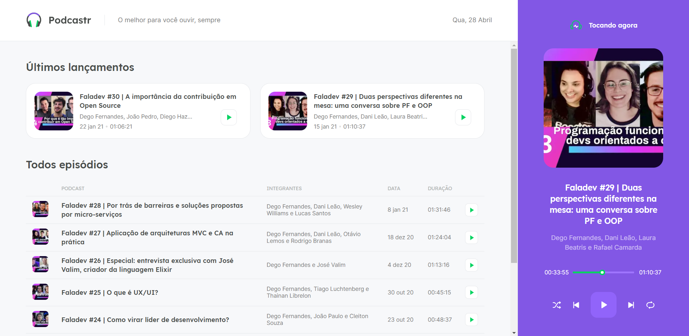

<h1 align="center">🎧 PODCASTR 🎧‍</h1>
<h3 align="center">🏆 NEXT LEVEL WEEK 5 🏆</h3>

### 🤔 O que é o Next Level Week?

Criado pela Rocketseat, o NLW é uma semana prática com muito código, desafios, networking e um único objetivo: te levar para o próximo nível.

Através do nosso método você aprende novas ferramentas, conhece novas tecnologias e descobre hacks que impulsionão a sua carreira.

Um evento online e totalmente gratuito que te ajuda a dar o próximo passo na sua evolução como dev.

_________

### ✨ Sobre o projeto:

<p align="center">

</p>

O Podcastr é uma aplicação desenvolvida durante a Next Level Week 5 de React da RocketSeat. Nele podemos escutar nossos podcasts preferidos e acompanhar a postagem de novos. O projeto foi construído ao longo de 5 dias com tecnologias e conceitos mais recentes do desenvolvimento web, usando NextJS e React e fazendo o fetch de uma API fake para trazer novos dados diariamente.
_________

## 💡 Tecnologias

Esse projeto foi desenvolvido com as seguintes tecnologias:

- [React](https://reactjs.org)
- [TypeScript](https://www.typescriptlang.org/)
- [Next](https://nextjs.org/)
- [Json Server](https://github.com/typicode/json-server)

_________

## 📝 Instalações e usos

Clone ou faça o downlod desse repositório:

```
# Clone o repositório
$ git clone https://github.com/LucasCancio/Podcastr-nlw05
```

Acesse a pasta do projeto e faça as instalações:

```
# Instale as dependencias
$ npm install

# Rode o Json Server
$ npm run server

# Inicie o projeto
$ npm run dev

# running on port 3000
```

_________


## ❤ Agradeço muito a [Rocketseat](https://rocketseat.com.br/)
